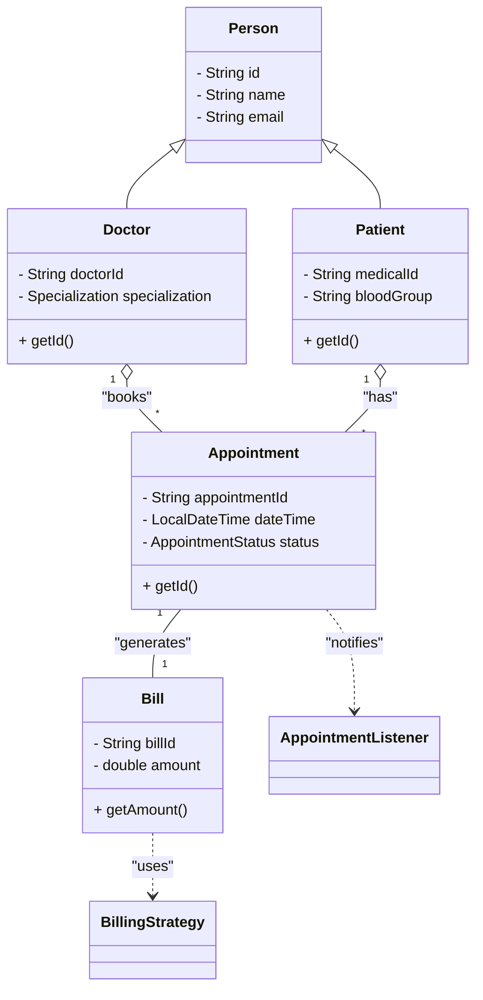

# Domain Model (Mermaid)

```mermaid
classDiagram
    class Person {
        - String id
        - String name
        - String email
    }
    class Patient {
        - String medicalId
        - String bloodGroup
        + getId()
    }
    class Doctor {
        - String doctorId
        - Specialization specialization
        + getId()
    }
    class Appointment {
        - String appointmentId
        - LocalDateTime dateTime
        - AppointmentStatus status
        + getId()
    }
    class Bill {
        - String billId
        - double amount
        + getAmount()
    }

    Person <|-- Patient
    Person <|-- Doctor
    Doctor "1" o-- "*" Appointment : "books"
    Patient "1" o-- "*" Appointment : "has"
    Appointment "1" -- "1" Bill : "generates"
    Bill ..> BillingStrategy : "uses"
    Appointment ..> AppointmentListener : "notifies"
```